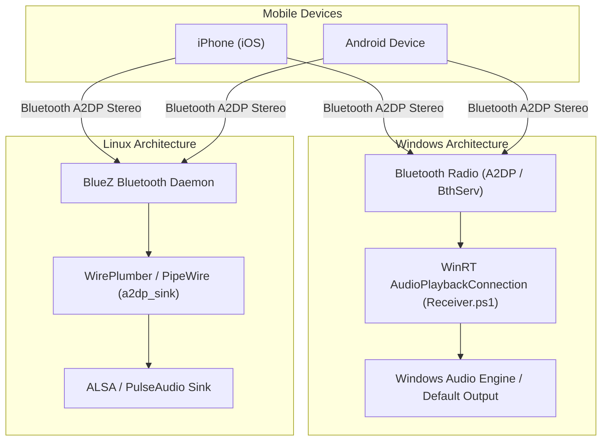

# phone-audio-receiver

Turn any PC (**Windows** or **Linux**) into a high-performance **Bluetooth audio receiver (A2DP Sink)**. Stream music, podcasts, videos, and calls seamlessly from your iPhone, iPad, Android, or any Bluetooth-enabled device straight through your computer's speakers or headset with low latency and support for **simultaneous multi-device playback**.

This repository also includes battle-tested stability and power-management fixes for the notorious **MediaTek / AMD / Realtek / Intel Bluetooth stutter and disconnect bugs** (including MediaTek MT7921, AMD RZ608, and Filogic 3300).

---

## Features

- 🔊 **Crystal-Clear A2DP Stereo Audio**: Streams full stereo audio directly from phone to PC with native OS audio pipelines.
- 📱 **Simultaneous Multi-Device Streaming**: Connect and play audio from multiple phones or devices at the same time.
- ⚡ **Native & Lightweight**: No third-party driver bloatware or heavy background apps. Uses native Windows Runtime (`AudioPlaybackConnection`) on Windows and WirePlumber/PipeWire/PulseAudio on Linux.
- 🛡️ **Hardware Stability Fixes**: Solves aggressive Bluetooth Low-Power / Selective Suspend disconnects and stuttering on MediaTek, Realtek, and AMD Wi-Fi/BT combo cards.
- 💻 **Global Windows CLI (`par`)**: One-command management (`par start`, `par stop`, `par status`, `par list`) with optional auto-start on boot.
- 🎙️ **Calls & Microphone Support**: Route call audio through your PC speakers and use your PC microphone for phone calls.

---

## Repository Structure

```text
phone-audio-receiver/
├── Linux/
│   ├── configs/
│   │   └── 51-bluetooth-fix.conf       # WirePlumber BlueZ A2DP stability & HFP configuration
│   └── install.sh                      # Automated Linux installer & setup script
├── windows/
│   ├── configs/
│   │   └── MediaTek-Windows-Fix.reg    # Registry stability fix for Bluetooth selective suspend
│   └── Receiver.ps1                    # Native WinRT audio receiver controller & CLI
├── LICENSE                             # MIT License
└── README.md                           # Documentation
```

---

## Platform Guide

- **[Windows (PowerShell)](#windows-powershell)**
  - [Requirements](#windows-requirements)
  - [Quick Start](#windows-quick-start)
  - [CLI Reference (`par`)](#the-par-command)
  - [Multi-Device Streaming](#windows-multi-device-streaming)
  - [MediaTek & Power-Saving Fix](#the-windows-mediatek-mt7921-stability-fix)
  - [Calls & Microphone](#calls--microphone-on-windows)
  - [Troubleshooting](#windows-troubleshooting)
- **[Linux (Bash)](#linux-bash)**
  - [Requirements](#linux-requirements)
  - [Quick Start](#linux-quick-start)
  - [Installer Options](#installer-options)
  - [MediaTek & PipeWire Fix](#the-linux-mediatek-mt7921-fix)
  - [Calls & Microphone](#calls--microphone-on-linux)
  - [Uninstallation](#linux-uninstallation)

---

## Windows (PowerShell)

Built natively for **Windows 10 (Version 2004 / Build 19041+)** and **Windows 11** using Windows Runtime (`Windows.Media.Audio.AudioPlaybackConnection`) and PowerShell.

### Windows Requirements

- Windows 10 (Build 19041+) or Windows 11
- Built-in or USB Bluetooth adapter (Bluetooth 4.0+)
- PowerShell 5.1+ (installed by default on Windows) or PowerShell 7+

### Windows Quick Start

1. **Clone or download the repository:**

   ```powershell
   git clone https://github.com/Chiazor-Daniel/phone-audio-receiver.git
   cd phone-audio-receiver
   ```

2. **Run the one-time installer** (in PowerShell as Administrator):

   ```powershell
   .\windows\Receiver.ps1 install
   ```

   *(Optional: Add `-Startup` to automatically start receiving audio whenever you log in: `.\windows\Receiver.ps1 install -Startup`)*

   > [!NOTE]
   > This step configures the Bluetooth audio service (`bthserv`), disables aggressive USB selective suspend, optimizes audio power profiles, installs the receiver standalone to `%LOCALAPPDATA%\PhoneAudioReceiver`, and adds the global `par` command to your `PATH`.

3. **Open a new terminal** and start streaming:

   ```powershell
   par start
   ```

4. **Pair your phone:**
   - On your **iPhone or Android**, go to **Settings → Bluetooth**.
   - Tap your PC's name and accept the pairing prompt on both devices.

5. **Press play on your phone!** All music, video, and app audio now streams through your PC speakers or headphones.

6. **Connect additional devices:** Any other paired device can connect and play audio at the same time.

> [!TIP]
> `par start` runs as a lightweight background process and stays active even after closing your terminal. Use `par stop` when you want to stop receiving audio.

---

### The `par` Command

Once installed, the `par` command is available from any directory in PowerShell or Command Prompt:

| Command | Description |
| :--- | :--- |
| `par start` | Starts receiving audio in the background *(default)* |
| `par start -Interactive` | Starts in foreground with live device connection logs |
| `par start -DeviceName "<name>"` | Filters and connects only to a specific device matching `<name>` |
| `par stop` | Stops background receiver processes and releases Bluetooth connections |
| `par status` | Displays receiver process status, startup task state, and connected devices |
| `par list` | Lists all currently connected Bluetooth audio devices |
| `par install` | Runs one-time setup (Bluetooth services, driver optimizations, `par` CLI) |
| `par install -Startup` | Performs installation and registers a scheduled task to auto-start on logon |
| `par install -DryRun` | Simulates installation without modifying system registry or files |
| `par uninstall` | Terminates receiver, removes startup task, and cleans up PATH and installed files |
| `par -Help` | Displays built-in help and usage instructions |

> [!NOTE]
> You can also invoke the script directly without installing using `.\windows\Receiver.ps1 [action] [options]`.

---

### Windows Multi-Device Streaming

The receiver automatically detects and binds to **all actively connected Bluetooth audio devices**:

- Multiple phones or tablets can stream audio simultaneously to your PC's default audio device.
- Devices powered off or out of range are ignored, keeping system overhead minimal.
- If a phone briefly drops connection, the receiver automatically attempts recovery before releasing the handle.
- Background discovery periodically scans for newly paired or reconnecting devices without interrupting active audio streams.

---

### The Windows MediaTek (MT7921) Stability Fix

On Windows, Wi-Fi/Bluetooth combo chipsets (such as **MediaTek MT7921 / MT7922**, **AMD RZ608 / RZ616**, and **Filogic 3300**) often suffer from aggressive USB/PCIe **Selective Suspend**. Windows places the Bluetooth controller into low-power sleep during brief audio pauses, causing:

- Immediate audio stuttering when playback starts or resumes
- Frequent connection drops and unpairing
- Audio crackling or latency spikes

Running `par install` automatically applies:

1. **Registry stability parameters** ([`windows/configs/MediaTek-Windows-Fix.reg`](windows/configs/MediaTek-Windows-Fix.reg)) enabling `SystemRemoteWakeSupported`.
2. **Selective Suspend disabled** across all active Bluetooth PnP adapters (`SelectiveSuspendEnabled = 0`).
3. **Bluetooth power profile optimization** via `powercfg` to prioritize real-time audio stability over sleep states.

---

### Calls & Microphone on Windows

When your phone is paired to Windows, you have two options for handling voice and call audio:

1. **Windows Phone Link (Recommended)**:
   - Use the preinstalled Microsoft **Phone Link** app to answer and place phone calls directly on Windows using your PC's microphone and speakers.
2. **Bluetooth Handsfree Telephony**:
   - Open **Control Panel → Devices and Printers**.
   - Right-click your phone → **Properties** → **Services** tab.
   - Ensure **Handsfree Telephony** is checked if you want Windows to register your PC as a Bluetooth headset for phone calls.

---

### Windows Troubleshooting

<details>
<summary><strong>1. Phone is paired, but no audio plays through PC</strong></summary>

- Run `par status` or `par list` to ensure the receiver is running and detects your phone.
- If not running, execute `par start`. Unlike standard Bluetooth speakers, Windows requires an active A2DP receiver connection to route phone audio.
- Ensure audio is playing on the phone and the phone's media volume is turned up.
</details>

<details>
<summary><strong>2. Audio is crackling, stuttering, or dropping</strong></summary>

- Make sure you ran `par install` from an elevated PowerShell window (Run as Administrator) to apply the driver power fixes.
- If using a USB Bluetooth dongle, connect it to a **USB 2.0 port** or use a USB extension cable to avoid USB 3.0 2.4GHz radio frequency interference.
- Verify your Wi-Fi router isn't causing heavy 2.4GHz interference.
</details>

<details>
<summary><strong>3. 'par' command is not recognized</strong></summary>

- The installer adds `%LOCALAPPDATA%\PhoneAudioReceiver` to your user `PATH`. Close your current terminal and open a **new terminal window** for environment variable changes to take effect.
</details>

<details>
<summary><strong>4. Audio plays out of the wrong speakers or monitor</strong></summary>

- Windows routes incoming Bluetooth audio to the system's **Default Audio Output Device**.
- Open **Settings → System → Sound** (or click the speaker icon in the taskbar) and select your preferred output device.
</details>

<details>
<summary><strong>5. How to completely uninstall</strong></summary>

```powershell
par uninstall
```

*(Run in PowerShell as Administrator to remove the scheduled task, CLI files, and PATH entry).*
</details>

---

## Linux (Bash)

Supports modern Linux distributions running **PipeWire / WirePlumber** or **PulseAudio**:

- **Fedora / Nobara / RHEL**
- **Ubuntu / Debian / Linux Mint / Pop!_OS**
- **Arch Linux / Manjaro / EndeavourOS**
- **openSUSE / SUSE**

### Linux Quick Start

1. **Clone the repository:**

   ```bash
   git clone https://github.com/Chiazor-Daniel/phone-audio-receiver.git
   cd phone-audio-receiver
   ```

2. **Make the installer executable and run it:**

   ```bash
   chmod +x Linux/install.sh
   sudo ./Linux/install.sh --name "Living Room PC"
   ```

   *The script automatically installs required packages (`bluez`), enables the Bluetooth service, configures the audio sink, and applies stability fixes.*

3. **Pair and Stream:**
   - On your phone, open **Bluetooth Settings**.
   - Tap your PC's name (e.g., `Living Room PC`) to pair.
   - Press play! All phone audio now routes to your Linux audio output.

---

### Installer Options

| Flag | Description |
| :--- | :--- |
| `--name "<name>"` | Custom friendly name visible to phones during Bluetooth discovery *(default: hostname)* |
| `--dry-run` | Prints all planned actions without modifying system files or services |
| `-h`, `--help` | Displays help message and command-line usage |

---

### The Linux MediaTek (MT7921) Fix

On Linux with MediaTek/Filogic chipsets, upstream BlueZ hands A2DP off to hardware DSP decoding by default, which can misreport stream completion and cause disconnects the moment audio playback starts.

The installer deploys [`Linux/configs/51-bluetooth-fix.conf`](Linux/configs/51-bluetooth-fix.conf) to `/etc/wireplumber/wireplumber.conf.d/51-bluetooth-fix.conf`:

```ini
# phone-audio-receiver: BlueZ A2DP stability + HFP (AirPods-like mic) config
monitor.bluez.properties = {
  bluez5.hw-offload-datapath = false
  bluez5.enable-hw-volume = false
  bluez5.enable-hfphsp = true
  bluez5.roles = [ a2dp_sink hfp_hf ]
}
wireplumber.settings = {
  bluetooth.autoswitch-to-headset-profile = false
}
```

This configuration:
- Forces reliable software decoding (`hw-offload-datapath = false`)
- Disables hardware volume passthrough to prevent volume desynchronization
- Enables both `a2dp_sink` (high-quality stereo media) and `hfp_hf` (handsfree unit)
- Prevents annoying automatic profile downgrading

---

### Calls & Microphone on Linux

By enabling `hfp_hf` alongside `a2dp_sink`, your Linux machine acts as a Bluetooth handsfree unit:

- **Incoming & Outgoing Calls**: The caller's voice plays over your PC speakers.
- **AirPods-Style Microphone**: Your PC's microphone serves as the input microphone for the call.

You can verify audio sinks and sources anytime using:

```bash
wpctl status       # PipeWire
pactl list sinks   # PulseAudio
```

---

### Linux Uninstallation

To remove the configuration and restore defaults:

```bash
sudo rm -f /etc/wireplumber/wireplumber.conf.d/51-bluetooth-fix.conf
sudo systemctl --user restart wireplumber pipewire
sudo bluetoothctl system-alias ""
```

---

## How It Works



- **On Windows**: Windows 10/11 includes the WinRT API `Windows.Media.Audio.AudioPlaybackConnection`. `Receiver.ps1` dynamically loads the Windows Runtime classes via `.NET`, queries paired devices using `DeviceInformation`, and connects audio streams directly without third-party audio drivers or virtual cables.
- **On Linux**: BlueZ handles the Bluetooth connection, while PipeWire / WirePlumber registers the PC as an A2DP audio sink (`a2dp_sink`) and Hands-Free profile (`hfp_hf`).

---

## License

This project is licensed under the [MIT License](LICENSE).